## Week 2 homework - Mixup of some basic Linux commands and Git commands

### Task: For actual task execution you need to do following:

    *   Access Wargames labs available on the following link: https://overthewire.org/wargames/ and on level Bandit solve tasks up to level 10

    *   After completing each level take screenshoot of your screen as a confirmation of successfully completed level

 

### 1. Level 0:
 

`$ ssh bandit0@bandit.labs.overthewire.org -p 2220`   -   # komanda SSH se koristi za spajanje na neki udaljeni server, dok sa opcijom -p gadjamo odredjeni port. 
 
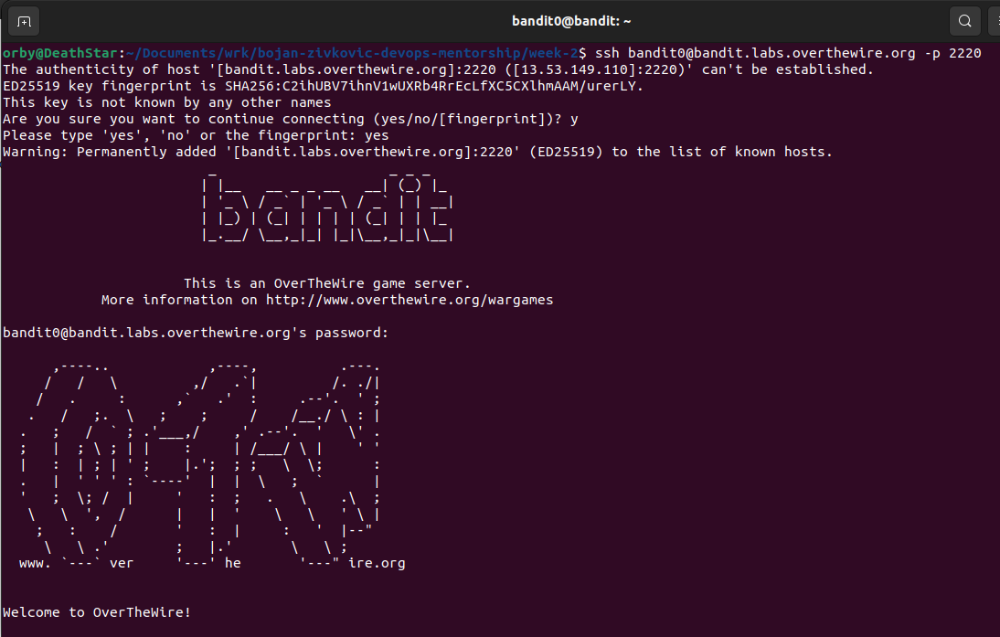
 

### 2. Level 1:

`$ ls`   -   # komanda ls za izlistavanje fajlova. 
`$ cat readme`   -   # komanda concatenate za iscitavanje sadrzaja fajla. 
`$ logout`   -   # komanda logout da se izlogujemo. 
`$ ssh bandit1@bandit.labs.overthewire.org -p 2220` 
 

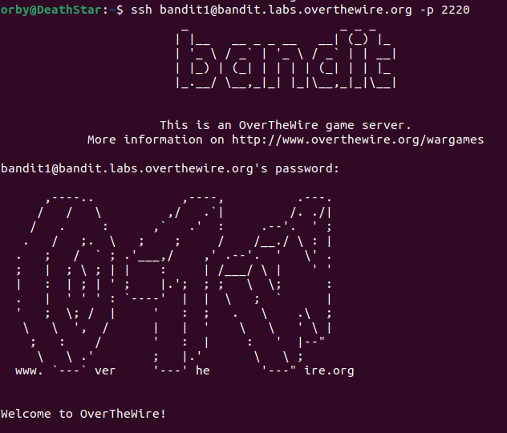
 

### 3. Level 2:
`$ ls` 
`$ cat ./-` 
`$ logout` 
`$ ssh bandit2@bandit.labs.overthewire.org -p 2220` 

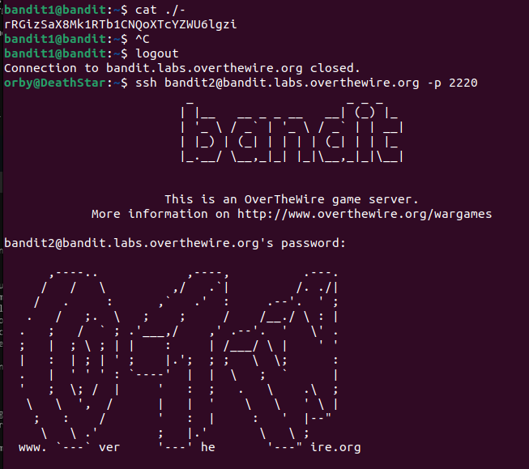
### 4. Level 3:

`$ ls` 
`$ cat 'spaces in this filename'`   -   # zbog razmaka u nazivu fajla, moramo koristiti jednostruke ili dvostruke navodnike.  
`$ logout` 
`$ ssh bandit3@bandit.labs.overthewire.org -p 2220` 
 
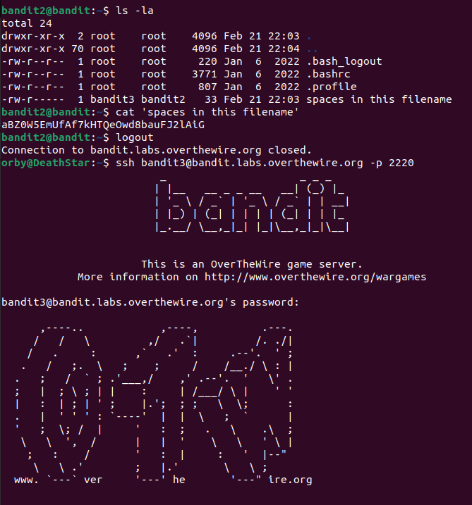

### 5. Level 4:
`$ ls` 
`$ cd inhere`    -   # komanda cd je za promjenu direktorijuma. 
`$ ls -la`   -   # dodajemo "-la" kako bi izlistali i nevidljive fajlove. 
`$ cat .hidden` 
`$ logout` 
`$ ssh bandit4@bandit.labs.overthewire.org -p 2220` 
 

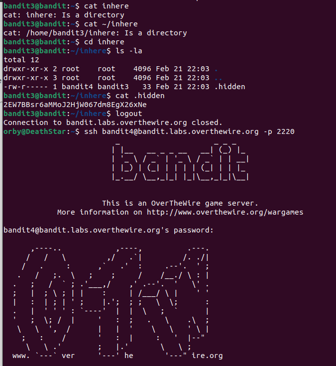

### 6. Level 5:
`$ ls` 
`$ file ./-file0*`    -   # komandom file utvrdjujemo kojeg su tipa fajlovi, a sa dodavanjem ./-file0* definisemo da se testiranje obavi na svim fajlovima u direktorijumu koji pocinju sa "-file0x".  
`$ cat ./-file07`    -   # jedini koji je bio u ASCII kodu, sto je ljudski citljiv format, kao sto je trazeno u zadatku. 
`$ logout` 
`$ ssh bandit5@bandit.labs.overthewire.org -p 2220` 

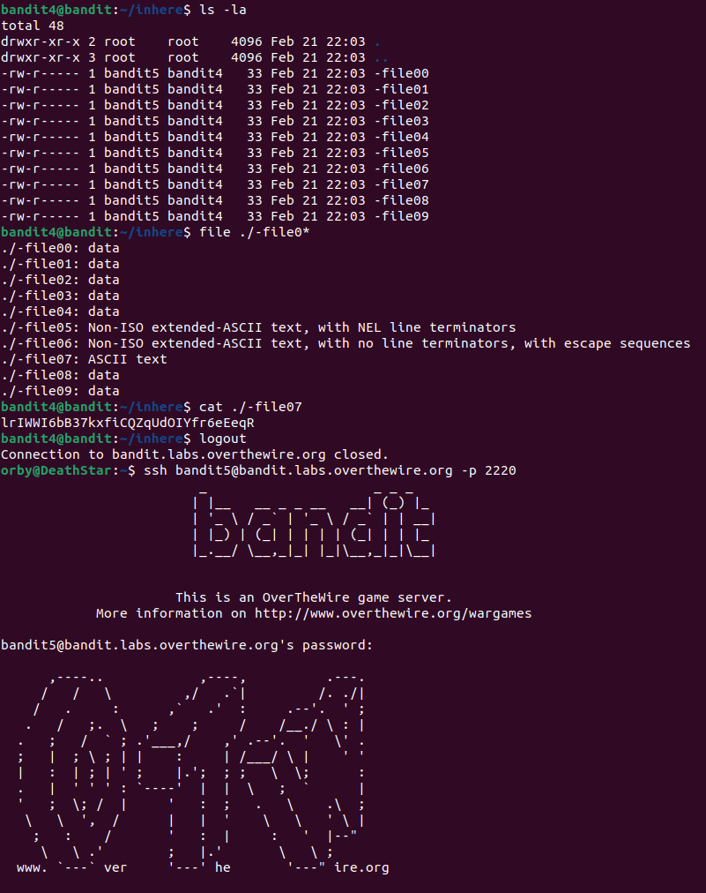

### 7. Level 6:
`$ ls` 
`$ find -type f -size 1033c ! executable` -   # komandom find pretrazujemo fajlove, opcijom -type f oznacavamo da trazimo obicne fajlove, opcijom -size 1033c oznacavamo da trazimo fajlove velicine 1033 bajta i na kraju dodajemo jos i dodatak da trazimo fajlove koji nisu egzekutabilni. 
`$ cd maybehere07` 
`$ cat .file2` 
`$ logout` 
`$ ssh bandit6@bandit.labs.overthewire.org -p 2220` 

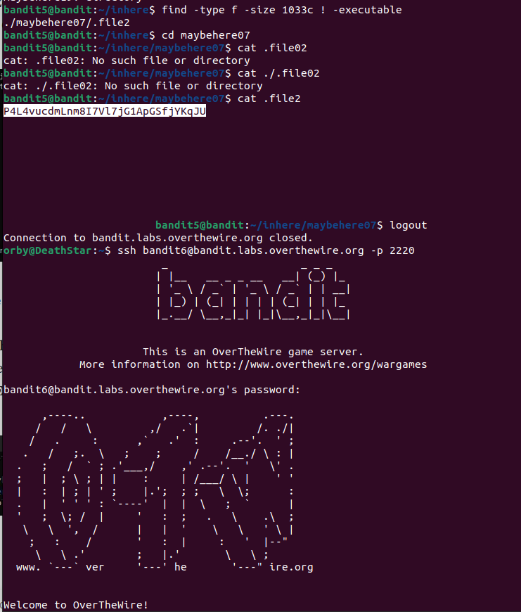

### 8. Level 7:
`$ find / -user bandit7 -group bandit6 -size 33c | grep -F -v Permission | grep -F -v directory` -   # posto je u zadatku postavljeno da se odgovor nalazi na nepoznatom mjestu, uz komandu find koristili smo / da prestrazuje sve direktorijume, -user bandit7 kao ownera fajla, -group bandit6 kao grupu ownera fajla, -size 33c jer je fajl velicine 33 bajta, kao i dodatak grep kojim smo zadali pretrazivanje direktorijuma nad kojim nema zabrana pristupa. 
`$ cat /var/lib/dpkg/info/bandit7.password`  -   # ocitavanje procitanog fajla. 
`$ logout` 
`$ ssh bandit7@bandit.labs.overthewire.org -p 2220` 

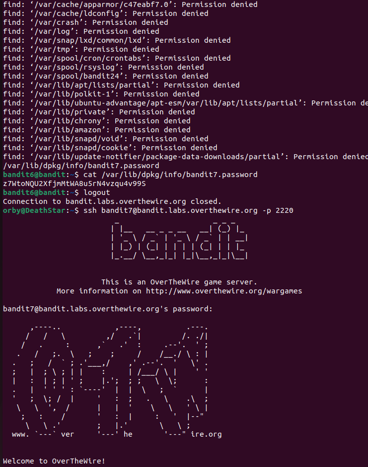

### 9. Level 8:
`$ ls` 
`$ nano data.txt`   -   # komadnom nano smo otvorili tekstualni editor, izvrsili pretrazivanje pojma millionth i kopirali password potreban da se predje nivo. 
`$ logout` 
`$ ssh bandit8@bandit.labs.overthewire.org -p 2220` 

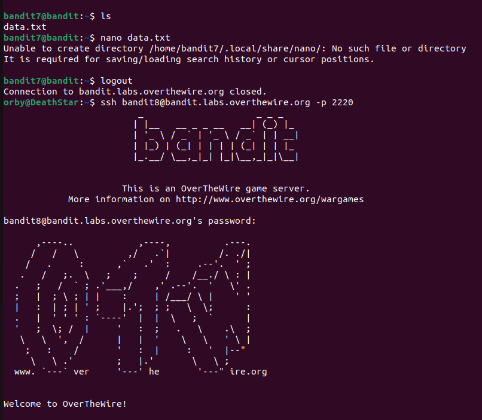

### 10. Level 9:
`$ ls` 
`$ sort data.txt | uniq -u` -   # komandom sort izvrsili smo sortiranje u fajlu, uz dodatak postavljanja uslova "uniq -u" kojim je naredjeno pretrazivanje samo jednog ponavljanja. 
`$ logout` 
`$ ssh bandit9@bandit.labs.overthewire.org -p 2220` 

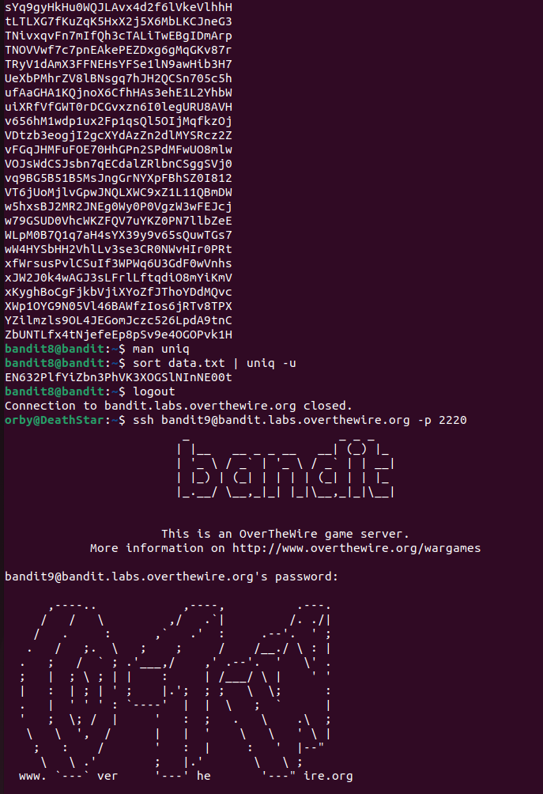

### 11. Level 10:
`$ ls` 
`$ strings data.txt | grep ==`  -   # komandom strings izvrsili smo pretrazivanje data.txt fajla uz uslov da pronalazi svako pojavljivanje od bar 2 == znaka. 
`$ logout` 

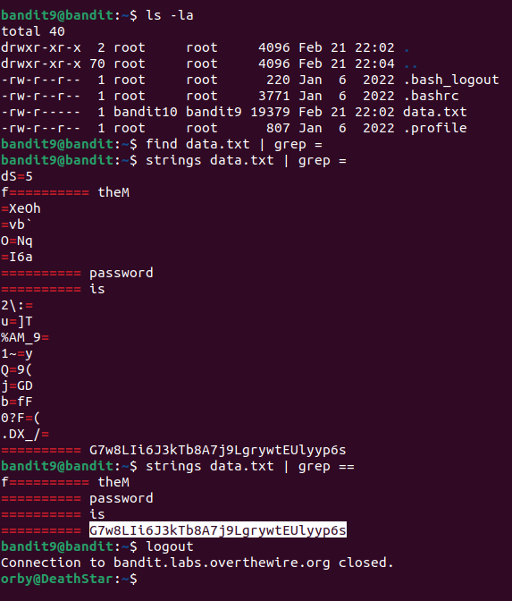
